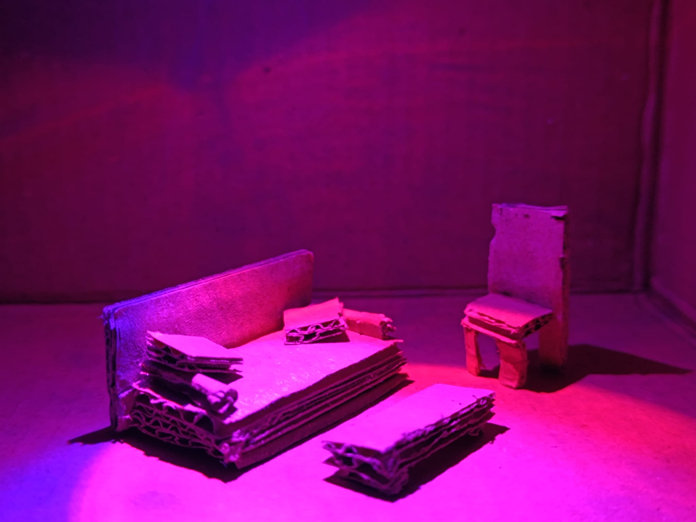
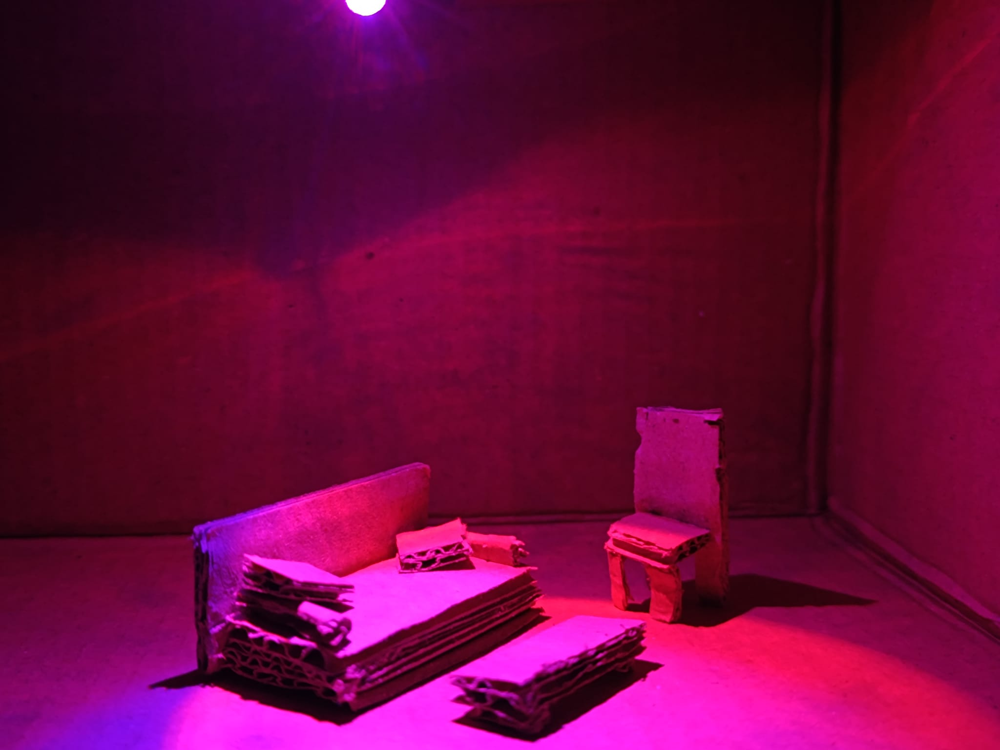
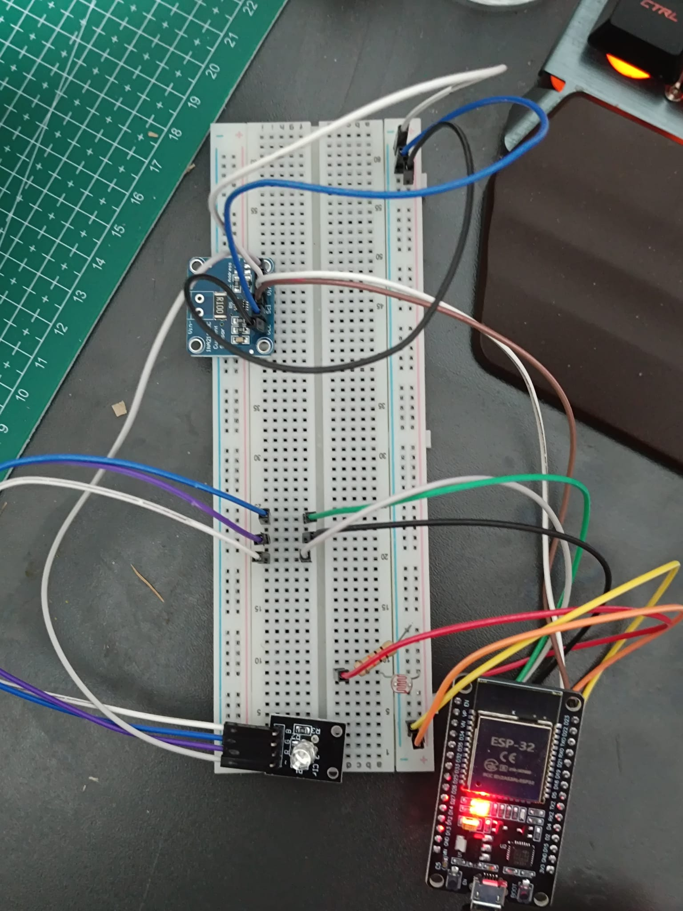
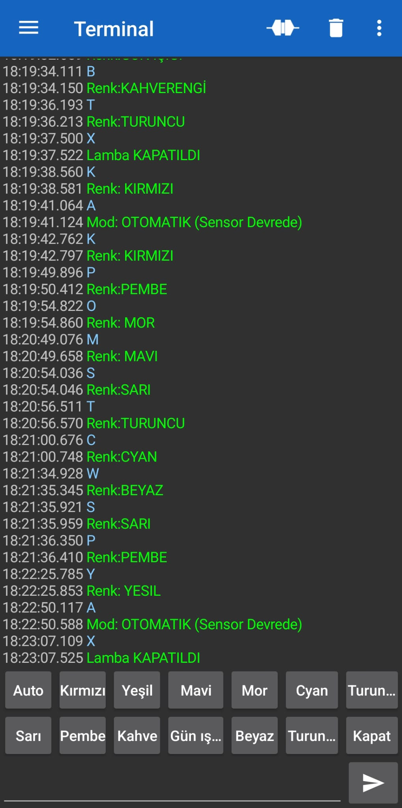

# Akilli-led-projesi
Bu proje, ev otomasyonu kapsamında geliştirilmiş bir akıllı aydınlatma sistemidir. Sistem; Manuel, Bluetooth ve Wi-Fi olmak üzere üç farklı arayüz üzerinden kontrol edilebilir. RGB LED ile dinamik renk yönetimi sağlarken, entegre akım sensörleri sayesinde enerji tüketimi hesabı yaparak Thingspeak üzerinden enerji verimliliği takibi sunar. 
## 💡 Prototip Simülasyon Ortamı

Sistemin farklı renk modlarının bir oda üzerindeki etkisi, ölçekli fiziksel model üzerinde gösterilmiştir.

<p align="center">
  
  &nbsp; &nbsp; 
</p>

*Solda: Rahatlama Modu, Sağda: Odaklanma/Okuma Modu*

## 📱 Sistem ve Kontrol Arayüzü

Aşağıda sistemin fiziksel kurulumu ve mobil kontrol arayüzü görülmektedir.

<h3>🏠 Fiziksel Kurulum Detayları</h3>



<p>
   İçerisindeki akım ölçer ile birlikte güç tüketimi 
  hesaplayıp ldr sensör ile ışık seviyesini ölçerek 
  enerji tasarrufu yapmayı planlayan proje. Veriler 
  Thingspeak'e aktarılıp istendiği zaman uzaktan 
  kontrol edilebilmektedir.
</p>

<h4>🏠 Fiziksel Kurulum Detayları</h4>



<p>
   Esp32 ile birlikte bluetooth terminal üzerinden 
  kontrol edilebilen sistem 13 farklı moda sahiptir.
  Bunlar; otomatik mod, kırmızı, yeşil, mavi, mor, 
  cyan, turuncu, sarı, pembe, kahverengi, gün ışığı,
  beyaz ve kapat modlarıdır. 
</p>
<p>
  Sistem bağlantıları yapılırken lehimleme teknikleri kullanılmış ve kablo karmaşası 
  kutu arkasına gizlenmiştir.
</p>

<br clear="left"> ```
